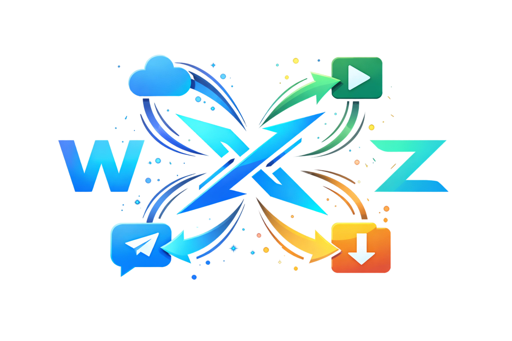

> [!NOTE]  
> **SML-Mirror** — A powerful Telegram Mirror & Leech Bot with multi-source support.

<p align="center">
    <a href="https://t.me/NullError_XD">
        
    </a>

<i>SML-Mirror is a feature-enhanced Telegram bot for mirroring and leeching files from various sources. Supports direct links, torrents, NZB, YouTube-DLP, Mega, Google Drive, Rclone, Facebook videos, Instagram, and more. Deployable on VPS and Heroku.</i>

</p>

<div align=center>

[](https://t.me/NullError_XD)
[](https://t.me/CodeNinjaXd)

</div>

---

## Features

- **Mirror / Leech** — Download files and upload to Google Drive, Rclone, or Telegram
- **Multiple Sources** — Direct links, Torrents, Magnet, NZB, Mega, YouTube, Facebook, Instagram
- **Torrent Management** — qBittorrent & Aria2 support with seed ratio control
- **Rclone Integration** — Mirror to any Rclone-supported cloud storage
- **Google Drive** — Service account support, Team Drive, clone, count, search
- **YouTube-DLP** — Download videos/playlists from 1000+ sites
- **Facebook Video** — Auto-detect and download HD + SD qualities
- **File Management** — Extract, compress, split, convert audio/video with FFmpeg
- **Queue System** — Multi-task queue with status tracking
- **User Management** — Authorized users, sudo, custom settings per user
- **RSS Feed** — Auto-download from RSS feeds
- **Web Interface** — Torrent file selector and status dashboard
- **Docker Support** — Easy deployment with Docker & docker-compose

---

## Deployment Guide (VPS)

<details>
  <summary><strong>View All Steps <kbd>Click Here</kbd></strong></summary>

### 1. Prerequisites

- Ubuntu 20.04+ VPS
- Docker & docker-compose installed
- Telegram Bot Token from [@BotFather](https://t.me/BotFather)
- Google Drive API credentials (for GDrive upload)

### 2. Clone & Configure

```bash
git clone https://github.com/CodeNinjaXd/SML-Mirror mirrorbot/
cd mirrorbot
```

Edit `config.py` and fill in your credentials:
- `BOT_TOKEN` — Your Telegram bot token
- `OWNER_ID` — Your Telegram user ID
- `TELEGRAM_API` & `TELEGRAM_HASH` — From https://my.telegram.org
- `DATABASE_URL` — MongoDB URL (for user data)
- `GDRIVE_ID` — Google Drive folder ID (for mirror uploads)

### 3. Build & Run with Docker

```bash
sudo docker build . -t smlmirror
sudo docker run -p 80:80 -p 8080:8080 smlmirror
```

**Using docker-compose (Recommended):**

```bash
sudo docker-compose up
```

After editing files, rebuild:
```bash
sudo docker-compose up --build
```

Stop:
```bash
sudo docker-compose stop
```

</details>

---

## Deployment Guide (Heroku)

<details>
  <summary><strong>View All Steps <kbd>Click Here</kbd></strong></summary>

Heroku deployment is supported. Check the channel for detailed Heroku deployment guide.

[](https://t.me/NullError_XD)

</details>

---

## Commands Reference

| Command | Description |
|---|---|
| `/mirror` `/m` | Mirror files to cloud storage |
| `/leech` `/l` | Leech files to Telegram |
| `/qbmirror` `/qm` | Mirror torrent via qBittorrent |
| `/qbleech` `/ql` | Leech torrent via qBittorrent |
| `/ytdl` `/y` | Download YouTube/other site videos |
| `/ytdlleech` `/yl` | Leech YouTube videos to Telegram |
| `/clone` `/cl` | Clone GDrive files/folders |
| `/count` | Count GDrive files |
| `/del` | Delete GDrive files |
| `/list` | Search GDrive files |
| `/search` | Torrent search |
| `/status` `/s` | View task status |
| `/cancel` `/c` | Cancel a task |
| `/cancelall` `/call` | Cancel all tasks |
| `/users` | Manage users (sudo) |
| `/bsetting` `/bs` | Bot settings (sudo) |
| `/usetting` `/us` | User settings |
| `/stats` `/st` | Bot statistics |
| `/help` `/h` | Help menu |
| `/restart` `/r` | Restart bot (sudo) |

---

## Supported Sources

- Direct HTTP/HTTPS links
- Torrents & Magnet links (Aria2 / qBittorrent)
- NZB (Sabnzbd)
- Facebook (`facebook.com`, `fb.com`, `fb.watch`, `fb.me`)
- Instagram (`instagram.com`)
- YouTube & 1000+ sites (yt-dlp)
- Mega.nz
- Google Drive
- Rclone remotes
- Telegram files
- JDownloader (Debrid)
- And more...

---

## Credits

| Role | Contact |
|---|---|
| **Owner & Developer** | [@CodeNinjaXd](https://t.me/CodeNinjaXd) |
| **Channel** | [@NullError_XD](https://t.me/NullError_XD) |

---

<p align="center">
  <b>SML-Mirror</b> — Simplify Your Workflow, Maximize Your Impact!
</p>
